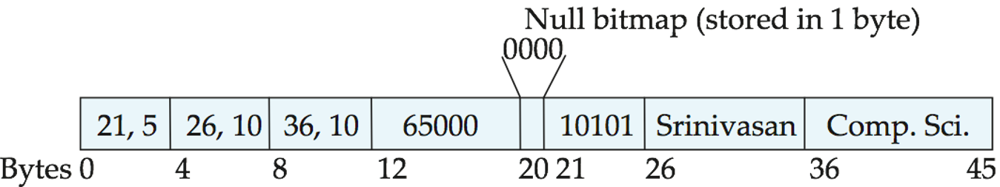

# 存储和文件结构
<!-- TOC -->

- [存储和文件结构](#存储和文件结构)
    - [物理存储介质概述](#物理存储介质概述)
    - [磁盘和快闪存储器](#磁盘和快闪存储器)
        - [磁盘的物理特性](#磁盘的物理特性)
        - [磁盘性能的度量](#磁盘性能的度量)
        - [磁盘块访问的优化](#磁盘块访问的优化)
        - [快闪存储](#快闪存储)
    - [RAID](#raid)
        - [通过冗余提高可靠性。](#通过冗余提高可靠性)
        - [通过并行提高性能](#通过并行提高性能)
        - [RAID级别](#raid级别)
        - [分级](#分级)
    - [文件组织](#文件组织)
        - [定长记录](#定长记录)
        - [变长记录](#变长记录)
    - [文件中记录的组织](#文件中记录的组织)
        - [顺序文件组织](#顺序文件组织)
        - [多表聚簇文件组织](#多表聚簇文件组织)
    - [数据字典存储](#数据字典存储)

<!-- /TOC -->

## 物理存储介质概述
- 大多数计算机系统中存在多种数据存储类型。可以根据访问数据的速度、成本、可靠性分类。
    - 高速缓冲存储器(cache)。（一般指cpu的缓存）
        - 高速缓冲存储器是最快最昂贵的存储介质，一般很小，由计算机系统硬件来管理。
    - 主存储器(main memory)。(一般指内存)
        - 主存储器是用于存放可处理的数据的存储介质。
    - 快闪存储器(flash memory)。
        - 快闪存储器不同于主存储器的地方是电源关闭时数据可保存下来。目前有两种类型的快闪存储器，称作NAND和NOR快闪。
    - 磁盘存储器(magnetic-disk memory)。
        - 用于长期联机数据存储的主要介质是磁盘。

- 根据不同存储介质的速度和成本，可以把他们按层次结构组织起来。层次越高，成本越高，速度越快。
    1. cache
    2. main memory
    3. flash memory
    4. magnetic-disk memory
- 最快的存储介质(如1和2)称为基本存储(primary storage)。
- 基本存储的下一层(磁盘)称为辅助存储(secondary storage)或联机存储(online storage)。
- 最低的层次称为三级存储(tertiary storage)或脱机存储(offline storage)。
- 不同存储系统除了速度和成本不一样，还存在一个存储易失性的问题。`易失性存储`(volatile storage)在设备断电后会丢失所有内容。
    - 基本存储是 易失性存储
    - 其他为 非易失性存储(nonvolatile storage)
- 为了保护数据，必须把数据写到 非易失性存储 中。

## 磁盘和快闪存储器
### 磁盘的物理特性
- 磁盘的物理结构：
    - 盘片(platter)
        - 磁盘有多个盘片，盘片是扁平的圆盘，他的两面都覆盖着磁性物质，信息就记录在上面。每条磁盘有1-5个盘片。
    - 读写头(read-write head)
        - 通过反转磁性物质磁化的方向，读写头将信息磁化存储到扇区中。
        - 磁盘的每个盘片的每一面都有一个读写头，读写头通过在盘片上移动来访问磁道。
    - 磁道(track)
        - 盘片的表面从逻辑上划分为磁道。每个盘片约有5,000~100,000条磁道。内侧的磁道（离转轴近的地方）长度较短，外侧磁道比内侧磁道有更多的山区。内侧磁道大约包含500~1000扇区，外侧1000~2000.
    - 扇区(sector)
        - 磁道又划分为扇区。是磁盘读出写入的最小单位。大小一般为512字节。
    - 簇
    - 柱面
    - 磁盘臂(disk arm)
        - 所有磁道的读写头安装在一个称为磁盘臂的单独装置上，并且一起移动。
        - 因为一起移动，当某一个盘片的读写头在第i条磁道上时，所有其他盘片的读写头也都在对应的i磁道上。
        - 因此，所有盘片的第i条磁道合在一起称为第i个柱面(cylinder).
- 当磁盘被使用时，会以恒定的高速旋转(7200 5400转就是指这个速度)。有一个读写头恰好位于盘片表面的上方。

- 磁盘控制器(disk controller)
    - 作为计算机系统和实际的磁盘驱动器硬件之间的接口。在磁盘驱动单元内部实现。
    - 接收高层次的读写扇区命令，移动磁盘臂和读写数据。
    - 他所写的每个扇区附加校验和(checksum)，校验和从写的数据计算得到的。
    - 每次读扇区数据会重新计算校验和比较，如果数据被破坏，校验和不一致的可能性就很高。
    - 如果校验和不一致，重读几次依旧不一致，发出读失败的信号。
    - 另一个任务是 `坏扇区的重映射`(remapping of bad sector)。如果检测到坏扇区，会把它的逻辑映射到另一个物理位置。（磁盘中有为此而设的额外扇区）。
- 磁盘接口有几个
    - SATA
    - SCSI
    - SAS

### 磁盘性能的度量
- 主要度量指标有 `容量` `访问时间` `数据传输率` `可靠性`。

1. 访问时间(access time)是从发出读写请求道数据开始传输之间的时间。
    - 为了访问扇区，磁盘臂首先移动定位到正确的磁道，然后等待磁盘旋转，直到指定的扇区出现在他的下方。磁盘臂重定位的时间称为 `寻道时间`(seek time)。它随磁盘臂移动距离增大而增大。
    - `平均寻道时间`(average seek time)是寻道时间的平均值，平均寻道时间大约是最长寻道时间的1/2.现在平均寻道时间约在4~10 ms之间。
    - 一旦读写头到达了所需的磁道，等待访问的扇区出现在读写头下所花费的时间称为`旋转等待时间`(rotational latency time)。
    - 一般磁盘的转速在每分钟5400转到15000，或说4~11ms每转。磁盘的`平均旋转等待时间`为磁盘旋转一周时间的1/2。
    - 访问时间是 `平均寻道时间` + `平均旋转等待时间`。范围在8~20ms之间。一旦带访问数据的第一个扇区来到读写头下，数据传输就开始了。

2. 数据传输率(data-transfer rate)是从磁盘获得数据或者向磁盘存储数据的速率。
    - 目前 最大传输率约为25~100MB/S,内侧磁道传输率明显低于最大传输率。如max 为 100MB的，内侧磁道传输率约为30MB.

3. 平均故障时间(Mean Time To Failure, MTTF),磁盘可靠性的度量标准。
    - 给定1000张磁盘，如果MTTF是1 200 000小时，则平均来说在1200小时内(1 200 000/1000)会有一张故障。

### 磁盘块访问的优化
- 磁盘I/O请求由文件系统和虚拟内存管理器产生的。每个请求制定了要访问的磁盘地址，这个地址是以 `块号` 的形式提供的。
    - 一个块(block)是一个逻辑单元，它包含固定数目的连续扇区。
    - 块大小在512字节到几KB.数据在磁盘和主存储器之间以块为单位传输。术语页(page)常指块。
- 来自磁盘的连续请求可以归类为 `顺序访问模式` 或 `随机访问模式`。
    - 在一个 `顺序访问`(sequential access)模式中，连续的请求会请求处于相同的磁道或是相邻的磁道上连续的块。访问第一块需要寻道时间，但是相继的请求不需要寻道。(也就是测速时的顺序存储速度)
    - `随机访问`(random access)，相继的请求会请求随机的块，每一个请求都需要寻道，一张磁盘一秒能满足的随机块访问数量取决于寻道时间，通常是每秒100~200。(测速时的随机速度)
- 为了提高访问块的速度，产生了许多技术。
    - 缓冲(buffering)
        - 从磁盘读取的块暂时存储在内存缓冲区中，以满足将来的要求。
    - 预读(read-ahead)
        - 当一个磁盘块被访问时，相同磁道的连续快也读入到内存中。
    - 调度(scheduling)
        - 如果需要把一个柱面上的几个块从磁盘传输到主存储器，我们可以按块经过读写头的顺序发出访问块的请求。
    - 文件组织(file organization)
        - 为了减少访问时间，我们可以按照与预期的数据访问方式最接近的方式来组织磁盘上的块。
    - 非易失性写缓冲区(nonvolatile write buffer)
    - 日志磁盘(log disk)
        - 先写到日志磁盘中，日志磁盘以后再完成写到实际磁盘中的操作。
    

### 快闪存储
- 一共有两种快闪存储器, `NOR` 快闪 和 `NAND` 快闪。
    - NOR快闪允许随机访问闪存中的单个字，拥有和主存可媲美的读取速度。
    - NAND快闪它读取需要将整个数据也从NAND快闪取到主存储器中，该数据页通常包括512~4096字节。数据页和磁盘中的扇区十分相似。
- NAND快闪明显比NOR快闪便宜，且容量大，更广泛使用。

- NAND快闪的存储系统提供与磁盘存储器相同的面向块的接口。
- 闪存的随机存取更快:一个数据页，1~2微妙即可检索到，而磁盘的随机访问则需要5~10ms。
- 闪存的传输速率比磁盘低，一般来说每秒20MB。有些闪存提高到100~200.然而，固态驱动器并行地使用多块闪存芯片，将传输速率提高到每秒200MB以上，比大多数磁盘要快。

- 闪存的写入比较复杂。写一个闪存页面需要几微秒。写入后，页面不能直接覆盖，必须先擦除再重写。
- 一次查出操作可以在多个页面执行，称为擦除块(earse block)，这种操作需要1~2毫秒。一个擦除块的大小通常比存储系统的块大很多，此外，一个闪存页的擦除次数存在限制，一般是10W~100W次。一旦超过限制，存储位就可能发生错误。
- 闪存系统通过映射逻辑页码到物理页码，限制了慢擦除速度和更新限制的影响。
    - 逻辑页更新时，可以重新映射到任何已擦除的物理页，原来的位置可以随后擦除。
    - 每个物理页都有一个小的存储区域来保存他的逻辑地址，如果逻辑地址重新映射到不同的物理页，原来的物理页被标记为已删除。
    - 通过扫描物理页可以发现逻辑页的位置。
    - 为了快速访问，逻辑到物理的页面映射被复制到内存的转换表(translation table)中。

- 包含多个删除页面的块会定期清除。未删除页面会先复制到其他块中。
- 由于擦除次数有限，擦除多次的物理页被比较为冷数据，存储很少更新的数据，擦除次数较少的页面存放更新频繁的 `热数据` 。这叫损耗均衡(wear leveling)。通常由闪存控制器透明执行。
- 物理页损坏就不再使用，不影响整个闪存。

- 上述动作通过 闪存转换层(flash translation layer)的软件层完成。在这一层之上，闪存存储器和磁盘存储器一样，有同样的接口。

## RAID
- 为了提高性能和可靠性，人们提出了统称 `独立磁盘冗余阵列` (Redundant Array of Independent Disk, RAID)的多种磁盘组织技术。
    - RAID的I现在代表的是独立(Independent)，原来则是廉价(inexpensive)。
    - 现在使用RAID是为了更高的可靠性和执行效率，而且易于管理和操作。

### 通过冗余提高可靠性。
- N张磁盘组成的集合中某张磁盘发生故障的概率比特定的一张磁盘发生故障的概率要高。

- 假设一张磁盘故障时间为 100 000小时（11年)，则100张磁盘的故障时间为100 000/100 = 1000小时(42天)。这样高的数据丢失率是无法接收的。
- 引入冗余(redundancy)是解决这个可靠性问题的方法。存储正常情况下不需要的额外信息，这些信息用于重建丢失的数据。
- 冗余最简单最昂贵的方法是复制每一张磁盘。这种技术称为镜像(mirroring)或影子。
- 采用镜像技术的平均故障时间依赖于单张 磁盘的平均故障时间和平均修复时间。
    - 平均修复时间是替换和恢复丢失数据的时间。
- 设单独磁盘故障时间为100 000小时，平均修复时间是10小时，则镜像磁盘系统的平均数据丢失时间为` 100 000^2/(2*10)=500* 10^6`小时，即5700年。

### 通过并行提高性能
- 通过磁盘镜像，处理读请求的速度将翻倍。
    - 因为读请求可以发送到任意一张磁盘上，同时从两张磁盘上读。

- 我们可以通过在多张磁盘上进行数据拆分(striping data)来提高传输速率。
    - 最简单的形式是每个字节按比特分开，存储到多个磁盘上。`比特级拆分`(bit-level striping)
        - 如把数据拆分为8个比特一组，每个比特存储到一个磁盘上，8张磁盘传输速率就是八倍。

    - 块级拆分(block-level striping)是将块拆分到多张磁盘。
        - 假设块的逻辑编号从0开始，有n张磁盘，第i块存储到 (i mod n)+1块磁盘上。
        - 读大文件时，可以从n张磁盘读取n个块，获得高数据传输率。
        - 单块数据数据传输率和单个磁盘相同，但剩下的n-1块磁盘可以进行其他操作。
    
- 块级拆分是最常用的数据拆分形式。

### RAID级别
- 前述
    - 镜像提供了高可靠性，但他十分昂贵。
    - 拆分提供了高数据传输率，但不能提高可靠性。
    - 通过结合 奇偶校验位 和磁盘拆分思想，可以以较低的代价提供数据冗余，提出了不同的替换方案。
    - 方案具有不同的成本和性能之间的权衡，分为若干RAID级别。

### 分级
假设存储n张磁盘的数据

- RAID 0级(RAID level 0)，指块级拆分但没有任何冗余的磁盘阵列。
    - 0级需要n张磁盘
- RAID 1级(RAID level 1)，指使用块级拆分的磁盘镜像。
    - 1级需要2n张磁盘
    - 有些厂商使用 RAID 10级或1+0级指代使用拆分的磁盘镜像，1级指代不使用拆分的镜像。

- RAID 2级，称为内存风格的纠错码组织结构，使用奇偶校验位。2级使用字节拆分存储到多张磁盘上。
    - 奇偶校验位记录了字节中为1的位数是偶数还是奇数个。
    - 纠错码机制存储2个或更多的附加位，用于重建数据。
    - 2级需要7张磁盘

- RAID 3级。位交叉的奇偶校验组织结构。
    - 3级在2级基础上改进。与内存系统不同，磁盘控制器能够检测一个扇区是否正确地读出，所以可以用单一的奇偶校验位来检错和纠错。
    - 如果一个扇区被破坏，系统能准确地知道是哪个扇区坏了，并且对扇区中的每一位，系统可以通过计算其他磁盘上对应扇区的对应位的奇偶值来推断出该位是0还是1.
    - 如果其余位的奇偶校验位等于存储的奇偶校验位，则丢失的位是0，反之是1.
    - 3级需要5张磁盘。

- RAID 4级。块交叉的奇偶校验组织结构。
    - 像0级一样使用块拆分，此外在一张独立的磁盘上为其他N张磁盘对应的块保留一个奇偶校验块。

- RAID 5级，块交叉的分布奇偶校验位的组织结构。
    - 5在4基础上改进，将数据和奇偶校验位都分布到所有N+1张磁盘中。
    - 在5中，所有磁盘都能参与对读请求的服务。
    - RAID 5包含4，有更好的读写性能。

- RAID 6级，P+Q冗余方案。存储了额外的冗余信息，应对多张磁盘发生故障的情况。
    - 他为每4位存储2位的冗余信息。

---
## 文件组织
- 一个数据库被映射到多个不同的文件，这些文件由底层的操作系统来维护。这些文件永久地存在在磁盘上。

- 一个文件(file)在逻辑上组织成为记录的一个序列。

- 每个文件分成定长的存储单元，称为块(block)。块是存储分配和数据传输的基本单元。大多数数据库默认使用4~8KB的块大小，但是数据库允许创建时指定块大小。

- 一个块可能包含很多条记录。我们假定没有记录比块更大。

- 此外，每条记录都包含在单个块中，没有跨块的记录。

### 定长记录

- 考虑一下 instructor记录组成的文件。 instructor 记录每条 `53`字节。

- 我们可以用一种简单的方法存储：每53个字节存储一条记录。
    - 但是这样有两个问题：
    1. 除非块大小恰好是53的倍数，否则会跨块。

    2. 删除记录十分困难。
        - 当
- 第一个问题我们可以在一个块中只分配它能完整容纳的最大记录数。如块大小为100字节，则一个块只存一条记录。
- 第二个问题：当记录被删除时，我们可以把随后的记录往前移动。但是这样需要移动大量的数据。移动最后一条到被删除的位置可能容易一些。
    - 移动记录的做法并不理想，由于插入操作通常比删除更频繁，我们可以让被删除的记录占据的空间空着，一直等到随后进行的插入操作重用这个空间。
    - 为了达到这个效果，我们需要引入额外的机构。

- 在文件的开始处，我们分配一定数量的字节作为文件头(file header)。
- 文件头包含有关文件的各种信息。我们在这里存储被删除的记录的地址。

- 我们用这第一个记录来存储第二个可用记录的地址，以此类推，形成链表。经常称为空闲列表(free list)。

- 在插入新纪录时，使用文件头所指向的记录，并改变文件头的指针指向下一个可用记录，如果没有可用空间，就添加到文件末尾。

- 总结：
    1. 每个块只能存能完整容纳的最大记录数。
    2. 文件设有文件头，文件头存储被删除记录的地址，相当于空闲记录链表，如果链表为空，就插入到文件尾

### 变长记录
- 变长记录主要有如下2个问题：
    1. 如何描述一条记录，使得单个属性可以轻松抽取
    2. 块中如何存储变长记录，使得块中的记录可以轻松地抽取

问题解决方法：
1. 变长记录通常分为两个部分，初始部分是定长属性，接下来是变长属性。
    - 对于定长属性，分配存储他们的值所需的字节数。
    - 对于变长属性，则是记录为一个对(偏移量，长度)值。
        - 偏移量代表在记录中该属性的数据开始的位置，
        - 长度表示变长属性的字节长度。

    - 记录完属性的信息后，后面就是属性的值，是连续存储的。
    - 因此，无论定长还是变长，记录初始部分存储有关每个属性的固定长度的信息。
    -  

2. 处理在块中存储变长记录的问题。使用 `分槽的页结构`(slotted-page structure)。每个块的开始处有一个块头，包含以下信息:
    - 块头中记录条目的个数。
    - 块中空闲空间的末尾处。
    - 一个由包含 记录位置和大小 的记录条目 组成的数组。(一个记录条目含有记录位置和大小)

- 实际记录从块的尾部开始 `连续排列`。
    - 块中空闲空间是连续的，在块头数组的最后一个条目和第一条记录之间。
    - 如果插入一条记录，在空闲空间的尾部给这条记录分配空间，并将包含这条记录大小和位置的条目添加到块头。

- 如果一条记录被删除，它所占用的空间被释放，并且它的条目被设置成被删除（如记录大小设为-1）。
- 此外，块中在被删除记录之前的记录将被移动，使得由删除而产生的空闲空间被重用。（即往后移动）
- 并且所有空闲空间仍然存在于 `块头数组` 的最后一个条目 和 `第一条记录` 之间。
- 块中的空闲空间末尾指针也要修改。

- 只要块中有空间，使用类似的技术可以使记录增长或缩短。

---
## 文件中记录的组织
- 文件组织记录的几种可能
    1. 堆文件组织(heap file organization)。一条记录可以放在文件中的任何地方，只要那个文件有空间存放这条就。记录是没有顺序的。通常每个关系使用一个单独的文件。

    2. 顺序文件组织(sequential file organization)。记录根据其 `搜索码` 的值顺序存储。

    3. 散列文件组织(hashing file organization)。每条记录的某些属性上计算一个散列函数。散列函数的结果确定了记录应放到文件的哪个块中。

- 通常，每个关系的记录用一个单独的文件存储。但是在多表聚簇文件组织(multitable clustering file organization)中，几个不同关系的记录存储在同一个文件中。

### 顺序文件组织
- 顺序文件是为了高效处理按某个搜索码的顺序排序的记录而设计的。搜索码是任何一个属性或者属性的集合。我们通过指针把记录连接起来。每条记录的指针指向按搜索码顺序排列的下一条记录。

- 为了减少块访问数，物理上按搜索码顺序或者尽可能地按搜索码顺序存储记录。

- 然而，在插入和删除记录时维护记录的物理顺序是十分困难的。

### 多表聚簇文件组织
- 仔细地设计 `记录在块中的分配` 和块自身的 `组织方式` 可以获得性能上的好处。一个更复杂的文件结构将更有效，即使我们保留在一个独立的文件中存储一个关系的策略。

- 很多大型数据库系统在文件管理方面并不直接依赖于下层的操作系统，而是让操作系统分配给DBMS一个大的OS文件。DBMS把所有关系存储在这个文件中，并自己管理这个文件。

- 某些情况下，一个块存储多个关系的记录会很有用。

- 多表聚簇文件组织是一种在每一块中存储两个或者更多个关系的相关记录的文件结构。这样的文件组织允许我们使用一次块的读操作来读取满足连接条件的记录。

- (例如把经常要做连接查询的两个表的元组数据放到一个块中。)

- 但是也会对其他类型查询造成影响，因此要谨慎使用。

---
## 数据字典存储

- 一个关系数据库系统需要维护关于关系的数据，如关系的模式等。 这种"关于数据的数据"称为元数据(metadata)。

- 元数据存储在 `数据字典` (data dictionary)或 `系统目录`(system catalog)的结构中。

- 系统必须存储的信息类型有:
    - 关系的名字

    - 每个关系中属性的名字
    
    - 属性的域和长度

    - 在数据库上定义的视图的名字和这些视图的定义。

    - 完整性约束

- 此外，很多系统为系统的用户保存了
    - 授权用户的名字
    
    - 关于用户的授权和账户信息

    - 用于认证用户的密码或其他信息

- 数据库可能还会存储关于关系的统计数据和描述数据。
    - 每个关系中元组的总数
    - 每个关系所使用的存储方法

- P261

